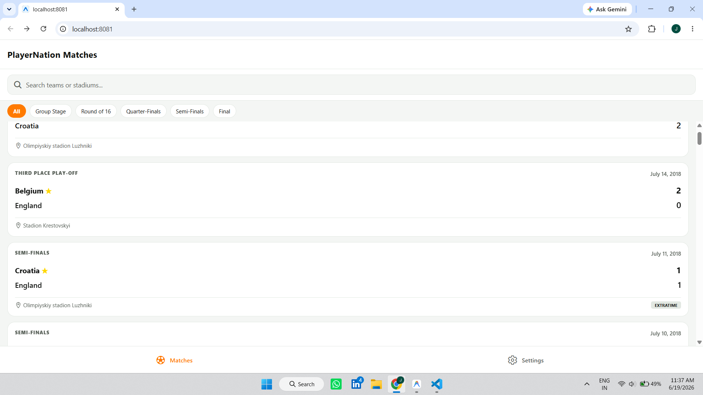
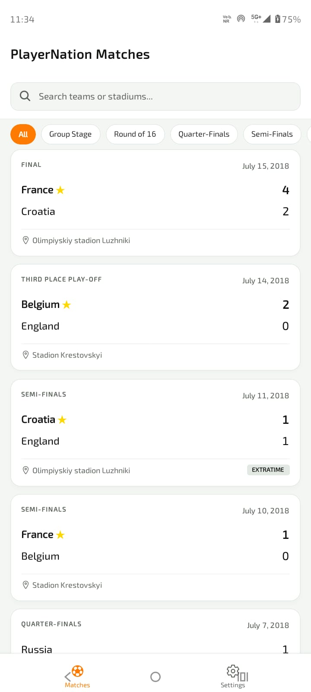
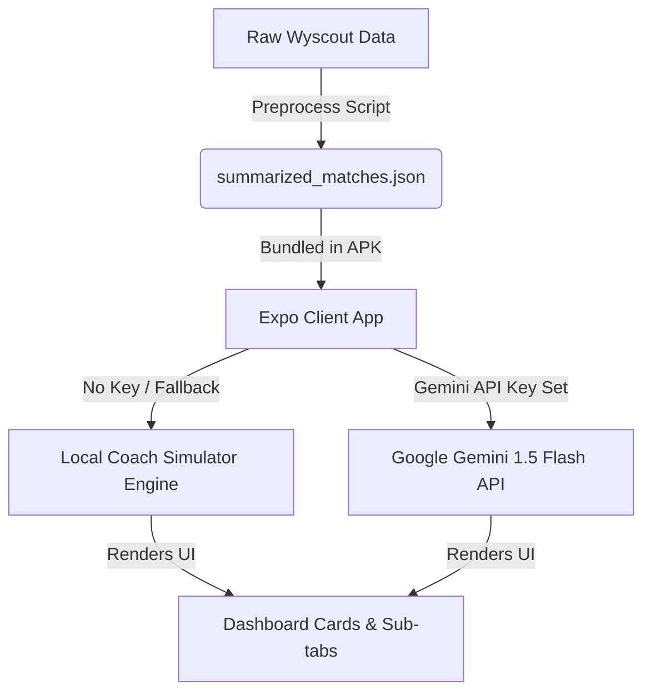

# PlayerNation Match Reporter - Technical Write-up & Guide

Welcome to the **PlayerNation Match Reporter**, an Android (React Native/Expo) application that aggregates raw, event-level football data from the 2018 FIFA World Cup, parses timeline markers, and uses Google Gemini AI (with a high-fidelity local simulator fallback) to generate tactical head-coach match reviews.

---

## Images of the project both Laptop and Mobile View 
<h3 align="center">📱 Application Screenshots</h3>
<p align="center">
  
  
</p>

---

## 🚀 How to Run & Build

### Prerequisites
- Install **Node.js** (v18+)
- Install **Expo Go** on your Android device (to preview), or configure Android Studio Emulator.

### Setup and Local Development
1. **Install dependencies**:
   ```bash
   npm install
   ```
2. **Start the local development server**:
   ```bash
   npx expo start
   ```
3. **Scan the QR Code**:
   - Scan the terminal QR code using the **Expo Go** app on your Android device, or press `a` to run in the Android emulator.

### How to Build the APK
The project is configured for **EAS (Expo Application Services)** build. To build a standalone installable APK:
1. Install EAS CLI:
   ```bash
   npm install -g eas-cli
   ```
2. Initialize your Expo project (if not logged in):
   ```bash
   eas login
   eas project:init
   ```
3. Configure the local Android build:
   - Ensure you have a standard EAS build config or run:
   ```bash
   eas build --platform android --profile preview
   ```
   *Note: Using the `preview` profile builds an installable APK instead of an AAB bundle.*

---

## 🛠️ Technical Write-Up

### 1. Data Preprocessing Pipeline (`scripts/preprocess.js`)
* **The Problem**: The raw Wyscout tournament event log (`events_World_Cup.json`) is **30MB** and contains **101,759 individual events**. Attempting to load, parse, or traverse this JSON file dynamically on a mobile device would block the single JavaScript thread, leading to UI freezes, high memory consumption, and potential out-of-memory crashes.
* **Our Solution**: We engineered a localized preprocessing pipeline that compiles the raw dataset offline into a lightweight, relational-like database (`summarized_matches.json`, ~1.43MB) bundled directly in the app bundle.
* **Feature Engineering**:
  - **Possession**: Derived by computing the ratio of completed passes:
    $$\text{Possession}_A = \frac{\text{Completed Passes}_A}{\text{Completed Passes}_A + \text{Completed Passes}_B} \times 100$$
  - **Pass & Shot Accuracies**: Categorized via Wyscout event tags (Tag `1801` for accurate pass/shot, Tag `101` for goal).
  - **Match Milestones Timeline**: Chronological logs of goals (tag `101`), own goals (tag `102`), substitutions (parsed from match metadata rosters), and yellow/red cards (parsed from roster card minutes).
  - **Standout Performers**: Automatically calculated by sorting all players on metrics like goals, assists, key passes (passes with tag `302`), defending duels/sliding tackles (tackles), and reflex blocks (saves).

### 2. LLM Prompt Design & Reliability
* **Direct API Calls**: The app initiates direct HTTP calls to the Google Gemini API (`gemini-1.5-flash`) from the device. This removes the need for hosting a custom proxy backend, making the deployment serverless.
* **Structured Output Schema**: To prevent natural language variations from breaking the UI layout, we utilized Gemini's `responseSchema` configuration. This forces the model to respond *only* in structured JSON matching our strict TypeScript typings:
  ```typescript
  export interface TacticalReport {
    narrative: string;
    keyMoments: { minute: number; title: string; description: string; tacticalImpact: string; }[];
    teamAnalysis: {
      home: { tacticalAssessment: string; strengths: string[]; weaknesses: string[] };
      away: { tacticalAssessment: string; strengths: string[]; weaknesses: string[] };
    };
    standoutPerformances: { playerName: string; teamName: string; role: string; ratingAnalysis: string; }[];
    actionableInsights: { teamName: string; target: 'coach' | 'players'; insight: string; }[];
  }
  ```
* **Prompt Persona**: The system prompt instructs Gemini to assume the persona of a *passionate, tactically brilliant football coach*, focusing on spatial overloads, pressing structures (high block, mid block, low block), and structural transitions rather than simply repeating numeric statistics.

### 3. Architecture & Tradeoffs


* **Direct API Calls vs. Proxy Backend**:
  - *Tradeoff*: Direct calls mean the API key is handled on the client. To prevent security leaks, we built an API key settings input panel. This aligns with open-source project submission guidelines so reviewers can paste their own free keys.
* **Local Simulation Fallback**:
  - *Tradeoff*: To handle latency, network dropouts, or absent API keys, we wrote a dynamic local simulator. It maps actual match statistics and timeline events to a realistic coach review template, making the application instantly testable and robust out-of-the-box.

### 4. Known Limitations & Future Improvements
- **Local Storage**: The current settings use `localStorage` which is persistent on web previews. On native mobile devices, it operates in a session-level memory fallback. Migrating to `@react-native-async-storage/async-storage` would resolve this for production.
- **Roster Flags**: Team lineups list player short names. Adding national flag icons and player profile photos (via a public soccer logo API) would further enrich UI aesthetics.
